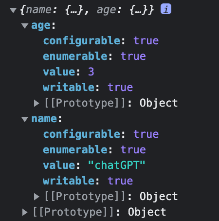

# [모딥다03] 프로퍼티 어트리뷰트

property
> an attribute, quality, or characteristic of something.

attribute
> To regard as arising from a particular cause or source; ascribe.

---


## 내부 슬롯 Internal slot, 내부 메서드 Internal Method 개념

컴퓨터 내부를 직접 만질 일은 거의 없다

*사진: [Unsplash](https://unsplash.com/ko/%EC%82%AC%EC%A7%84/gRQXs2KjrAo?utm_source=unsplash&utm_medium=referral&utm_content=creditCopyText)의[Florian Olivo](https://unsplash.com/es/@florianolv?utm_source=unsplash&utm_medium=referral&utm_content=creditCopyText)*

---


### ECMAScript Specs

- 내부 슬롯 = 의사 프로퍼티 Pseudo Property
- 내부 메서드 = 의사 메서드 Pseudo Method
(CSS의 Pseudo Class 처럼 직접 만들진 않았지만 이미 존재하는)

---


### 알려진 Property 숨겨진 Property

같아보이지만 다른,
다르지만 같은 속성을 공유하는

- Water is wet.
- Sky is Limit.

사진: [Unsplash](https://unsplash.com/ko/%EC%82%AC%EC%A7%84/nOXyvZp3MJs?utm_source=unsplash&utm_medium=referral&utm_content=creditCopyText)의[Ricardo Martins](https://unsplash.com/de/@rpmartins?utm_source=unsplash&utm_medium=referral&utm_content=creditCopyText)

---


### 프로토타입 Prototype

>An original type, form, or instance serving as a basis or standard.

모든 JS 오브젝트가 가지고 있는 내부 슬롯
```___prototype__``` 으로 간접 접근이 가능하다

사진: [Unsplash](https://unsplash.com/ko/%EC%82%AC%EC%A7%84/QjXY57GF1ik?utm_source=unsplash&utm_medium=referral&utm_content=creditCopyText)의[Yuta Koike](https://unsplash.com/@yuta129?utm_source=unsplash&utm_medium=referral&utm_content=creditCopyText)

---

## 프로퍼티 어트리뷰트

JS가 프로퍼티 속성 옵션들을 자동 생성, 정의(meta-property) 한다

- 데이터 프로퍼티
- 접근자 프로퍼티

---

### 데이터 프로퍼티

- **\[[Value\]]**
- \[[Writable\]] : Value 변경 여부
- \[[Enumerable\]] : ```for... in``` ```Object.keys```에서 열거 가능 여부
- \[[Configurable\]] : 프로퍼티 재정의(Value, Writable 변경 가능) 여부

열거
> 여러 가지 예나 사실을 낱낱이 죽 늘어놓음.

---



#### ```Object.getOwnPropertyDescriptors()```

```/* JavaScript */
const ai = {
  name : "chatGPT"
};

ai.age = 3;

// 간접적으로 상태 확인 가능
console.log(Object.getOwnPropertyDescriptors(ai));
```

---

### 접근자 프로퍼티 Accessor Property, 접근자 함수 Access Function

다른 데이터 프로퍼티에 접근 Access 하는 접근자 함수, 자체적인 Value가 없다

- \[[Get\]] : 값을 **가져올 get** 때 getter 함수 호출 &rarr; 프로퍼티 값으로 반환 return
- \[[Set\]] : 값을 **세팅할 set** 때 setter 함수 호출 &rarr; 프로퍼티 값을 저장
- \[[Enumerable\]] : 호출 대상의 속성, 데이터 프로퍼티와 동일
- \[[Configurable\]] : 호출 대상의 속성, 데이터 프로퍼티와 동일

---

#### 예제 : 코딩

```/* JavaScript */
const movie = {
  koreanTitle: "헤어질 결심", //데이터 프로퍼티
  englishTitle: "Decision to Leave", //데이터 프로퍼티
  get movieTitle() {
    return `${this.koreanTitle},${this.englishTitle}`
  },
  set movieTitle(name) {
    [this.koreanTitle, this.englishTitle] = name.split(',');
  }
}
```

---

#### 예제 : 출력

```/* JavaScript */
// 값을 가져와 getter 호출, 리턴
console.log(`${movie.koreanTitle},${movie.englishTitle}` ); // 헤어질 결심,Decision to Leave

// 값을 세팅하기 setter 호출
movie.movieTitle = "아가씨,The Handmaiden"; // {koreanTitle: "아가씨", englishTitle: "The Handmaiden"}

// 접근자 프로퍼티로 접근하면 getter 호출, 리턴
console.log(movie.movieTitle); // 아가씨,The Handmaiden

// movie.movieTitle 은 접근자 프로퍼티
console.log(Object.getOwnPropertyDescriptor(movie, "movieTitle"));

```

---

### 접근자 프로퍼티, 데이터 프로퍼티 구분법

- 일반 오브젝트의 ```__proto__```는 접근자 프로퍼티 - 객체의 연결(체인처럼)
  - 내부 메서드, 데이터를 감싸서 Capsulate, 전달받아 실행하거나 데이터를 전달하기 때문
- 함수 오브젝트의 ```__proto__```는 데이터 프로퍼티 - 데이터를 전달
  - 함수의 원래 목적인 코드를 재사용, 데이터로 저장해 데이터를 공유

```/*JavaScript*/
Object.getOwnPropertyDescriptor(Object.prototype, "__proto__");
// 결과 : {enumerable: false, configurable: true, get: ƒ, set: ƒ}
Object.getOwnPropertyDescriptor(function() {}, "prototype");
// 결과 : {value: {…}, writable: true, enumerable: false, configurable: false}

```

---

### 프로퍼티 정의 ```Object.defineProperty```

오브젝트의 프로퍼티에 속성을 새로 만들면서 정의, 또는 재정의 하는 메서드

```/*JavaScript*/
Object.defineProperty(objectName, property, { dataPropertyKey : dataPropertyValue });
Object.defineProperty(objectName, property, { accessorFunction(){} });

//여러개
Object.defineProperties(objectName, { property: { dataPropertyKey : dataPropertyValue}, property2 { ... }, });
Object.defineProperties(objectName, { property: accessorFunction(){}, property2: accessorFunction(){},  });
```

---

### 프로퍼티 변경 방지

- 오브젝트 확장 금지 ```Object.preventExtensions()```
  - 오브젝트 프로퍼티 추가만 금지
  - ```Object.isExtensible()``` 메서드로 확인 가능
- 오브젝트 밀봉 ```Object.seal()```
  - 오브젝트 프로퍼티 값 읽기, 쓰기 가능 / 프로퍼티 추가, 삭제, 어트리뷰트 재정의 불가
  - ```Object.isSealed()``` 메서드로 확인가능
- 오브젝트 동결 ```Object.freeze()```
  - 오브젝트 프로퍼티 값 읽기만 가능 / 나머지 불가
  - ```Object.isFrozen()``` 메서드로 확인 가능

---

## 오브젝트를 수정 못하게 얼리자

```Object.freeze()``` 로 얼려도 직속 오브젝트만 변경 방지이고,
중첩 객체에는 영향을 못준다

&rarr; 읽기 전용의 불변 오브젝트를 만들려면,
오브젝트로 값을 갖는 모든 프로퍼티를 재귀적으로 돌려서 얼려야 한다

---