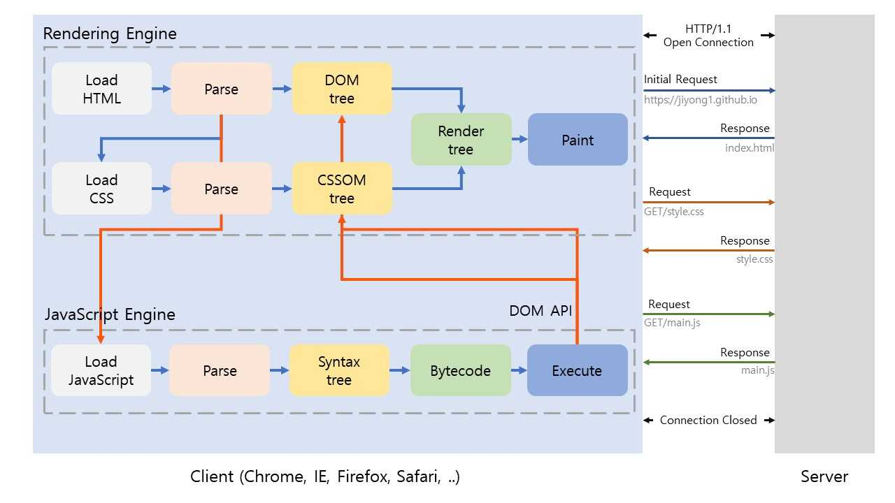
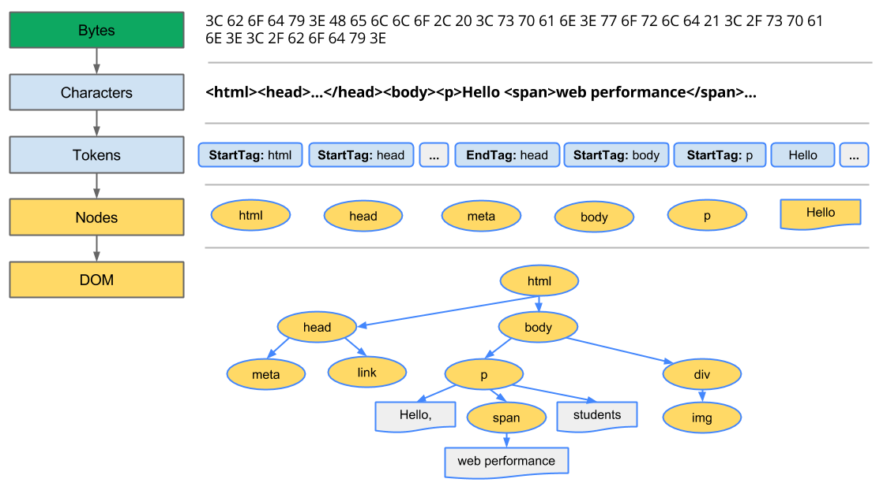

# How browser rendering works

## Parsing (in Browser)

[https://developer.mozilla.org/en-US/docs/Glossary/Parse](https://developer.mozilla.org/en-US/docs/Glossary/Parse)

> _Parsing_ means analyzing and **converting a program into an internal format that a runtime environment can actually run**, for example the JavaScript engine inside browsers.
> The browser parses HTML into a DOM tree. HTML parsing involves tokenization and tree construction. **HTML tokens include start and end tags, as well as attribute names and values**. If the document is well-formed, parsing it is straightforward and faster. The parser parses tokenized input into the document, **building up the document tree**.

HTML 구문을 분석해서 (시작태그, 끝태그, 속성, 값으로 구성한 토큰을 만들고) 문서 트리 구조를 만드는 것

## Rendering engine

[https://developer.mozilla.org/en-US/docs/Glossary/Rendering_engine](https://developer.mozilla.org/en-US/docs/Glossary/Rendering_engine)

> A _rendering engine_ is software that **draws text and images on the screen**. The engine draws _structured text from a document_ (often HTML), and formats it properly _based on the given style declarations_ (often given in CSS). Examples of layout engines: Blink, Gecko, EdgeHTML, WebKit.

구조화 된 문서와 선언한 스타일을 바탕으로 이미지와 텍스트를 그려냄

## 서버와 통신 과정

1. 브라우저는 HTML,CSS,JavaScript,이미지,폰트 등 리소스를 요청(Request) 하고 응답(Response)을 받는다
2. 응답받은 데이터에서 오브젝트를 생성
   1. HTML &rarr; DOM
   2. CSS &rarr; CSSOM
   3. 오브젝트를 결합해서 렌더 트리를 생성
3. JavaScript &rarr; AST(Abstract Syntax Tree) 생성
4. 바이트 코드로 변환, 실행
   1. 실행 도중 DOM API로 DOM, CSSOM을 변경할 수 있다
   2. 변경한 DOM, CSSOM은 다시 렌더 트리 생성
5. 렌더 트리를 기반으로
   1. HTML 레이아웃 계산
   2. 브라우저 화면에 HTML을 페인팅

HTML을 로드하는 도중에 외부 리소스를 로드하는 태그를 만나면 HTML파싱을 일시 중단하고 해당 리소스를 서버에 요청한다

(퍼온사진)

### URI : Uniform Resource Identifier

서버에 요청을 전송하기 위해 브라우저는 주소창 제공

- 프로토콜 `https://`
- 호스트(도메인) `www.domain.com`
  - DNS를 통해 IP로 변환, 서버에게 요청을 전송
  - 패스가 없고, 루트면 보통 `index.html` 에게 응답을 요청한다
- 포트 `:80`
- 패스 `/docs/search`
- 쿼리 `?category=javascript&lang=ko`
- 프래그먼트 `#intro`

## HTTP/1.1 HTTP/2

HyperText Transfer Protocol

- HTTP/1.1 1999
  - 커넥션당 하나의 요청과 응답만 처리
- HTTP/2 2015
  - 커넥션당 다중 요청과 응답 가능 (1.1보다 약 50% 빠름)

## HTML 파싱

1. 브라우저가 서버에 요청해서 응답하면
2. 메모리에 바이트로 저장
3. meta태그의 charset에 지정된 인코딩 방식 대로 문자열로 변환
4. 문자열화 된 HTML을 읽어 최소 의미 단위인 토큰(시작태그, 끝태그, 속성, 값의 묶음)으로 분해
5. 오브젝트로 변환해 노드 구조로 만든다
   1. 각 노드는 중첩관계로 부모 자식의 관계를 가진다
   2. 관계를 반영해서 트리 자료구조를 구성한다

(퍼온사진)

## CSS 파싱

1. HTML을 파싱하다가 CSS를 만나면 DOM을 일시 중단하고
2. 요청한 CSS 파일을 서버에 요청하고 로드(스타일을 가져온다)
3. HTML하고 동일하기 파싱 과정 (바이트 - 문자 - 토큰 - 노드 - CSSOM) 후 CSSOM을 생성한다
4. 완료하면 HTML DOM 생성을 재개

## 렌더 트리 생성

DOM과 CSSOM 가 결합

## 렌더링은 반복 실행될 수 있다 : 리렌더링

- 자바스크립트에 의한 노드 추가 삭제
- 브라우저 창 리사이징에 의한 뷰포트 크기 변경
- HTML 요소의 레이아웃에 변경(위치 크기)을 발생시키는 스타일 변경

레이아웃 계산, 페인팅을 다시 실행하면 비용과 자원이 소모된다
리렌더를 방지해보자

## 자바스크립트 파싱

이것도 HTML 쭉 읽다가 스크립트 태그 만나면 DOM 중지하고 스크립트 엔진에 제어권 넘기고 스크립트 파싱 실행하고 끝나면 다시 DOM 시작

1. 자바스크립트 파싱
   1. 어휘 분석하여 최소 단위 토큰으로 분해
   2. AST를 생성 - 트리 형태의 자료구조 [AST Explorer](https://astexplorer.net)
2. CPU가 이해할 수 있는 Low-Level Language로 변환 실행

모든 자바스크립트 엔진은 ECMAScript 사양을 준수한다

AST를 사용하면 트랜스파일러 transpiler를 구현할 수도 있다

- TypeScript
- Babel
- Prettier

(퍼온사진)

## 리플로우 Reflow 리페인트 Repaint

자바스크립트 DOM API를 사용하면서 DOM/CSSOM이 변경되서 레이아웃 페인트 과정을 다시 하는 걸 리플로우/리페인팅 이라고 한다

- 리플로우 : 레이아웃 계산을 다시 하는 것
- 리페인트 : 재결합한 렌더 트리를 기반으로 다시 페인트 하는 것

## Synchronous

브라우저는 순차적으로 싱크를 맞춰서(동기화) 작동하기 때문에 HTML이 뿌려지지도 않았는데 자바스크립트가 DOM을 조작하거나 하면 에러난다

그래서 자바스크립트를 body 닫는 태그 바로 위에 놓는 관습이 생겼다

### async/defer attribute

script src 로 로드하는 경우 자바스크립트 파싱하면 DOM 중단되는거 막을 수 있다

- async : HTML 파싱이 끝날 즈음에 자바스크립트 로딩하고 끝나면 자바스크립트 실행하고 끝나면 DOMContentLoaded 실행 : 싱크가 맞아야하는(동기방식) 경우에는 맞지 않음)
- defer : HTML 파싱하면서 자바스크립트 로딩하고 DOMContentLoaded 끝나고 자바스크립트 실행 (DOM 생성이 완료되고 실행해야 하는 자바스크립트)
