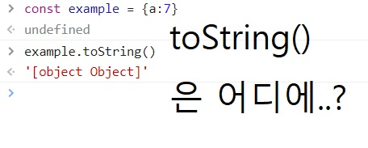
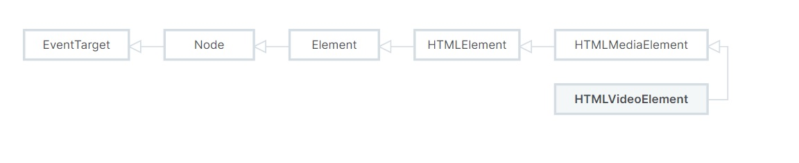
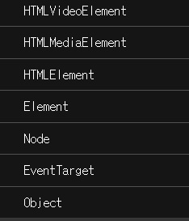

# 프로토타입

객체의 속성, 메서드에 대한 정보를 포함하고 있는 오브젝트.

객체지향의 상속을 구현하는 JS만의 독특한 요소.

- 상속은 먼저 정의된 것으로부터 속성과 메서드를 물려받는것

## 자바스크립트의 모든 객체는 프로토타입을 가짐.

원시타입(number, string, boolean, undefined, null)을 제외한 모든 JS의 요소들은
객체.

array(배열), object(오브젝트), fuction(함수) 같은 컴포넌트들은

이미 정의되어 있는 프로토타입을 청사진으로 삼아 생성.

# 예시

객체 내부에서 정의하지 않은 메서드 사용



- toString 메서드는 example 객체 내부에 없음.

        해당 메서드는 Object.prototype에 존재

        example은 객체이기때문에 생성될때 오브젝트 프로토타입을 상속받은것

## mdn 항목

mdn 문서의 메서드 목차. 전부 prototype이 써져있는 것을 볼 수 있음


# 프로토타입 체인

하나의 객체는 하나의 프로토타입을 상속

하지만 그 프로토타입또한 다른 프로토 타입을 상속받기도 함

이렇게 연쇄적으로 상속되는 구조를 `프로토타입 체인` 이라 부름.



# 과제에 사용한 video의 속성과 메서드는 어디서 왔을까?

HTMLVideoElement을 가져오는 코드

```
const video = document.querySelector("video");
```

프로토타입 출력함수

```
const getProtoChain = (obj) => {

    let proto = Object.getPrototypeOf(obj);

    if (!proto) return; // 프로토타입이 없다면 함수종료.

    console.log(proto.constructor.name);
    getProtoChain(proto); // 재귀호출
};

getProtoChain(video);
```

- 출력결과



### 속성 및 메서드 출처 분류

오늘 비디오 플레이어 과제를 하면서 사용한 속성 및 메서드들

```
video.volume
video.play()
video.pass()
video.muted
video.requestFullscreen();
video.duration
video.currentTime
video.addEventListener
```

각 속성 및 메서드의 출처

```
HTMLMediaElement: volume, play(), pause(), muted, duration, currentTime

Element: requestFullscreen()

EventTarget: addEventListener
```
