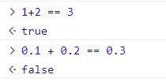

# Number

<br>

## 래퍼객체

- new 생성자를 사용시 래퍼객체의 인스턴스를 생성
- 생성자 안쓰면 해당 타입의 원시값 생성

<br>

### 강의 복습: new 키워드 없이 래퍼객체 사용

```
String ()
Boolean ()

// loggedIn 값을 Boolean으로 변환하여 저장
res.locals.loggedIn = Boolean(req.session.loggedIn);

<br>

```

## Number.EPSILON

값

```
2.220... * 10*(-16)

2^(-52)
```

<br>

### 존재 이유

자바스크립트는 IEEE 754표준으로 부동소수점을 표현

- 수를 2진법으로 표현시 무한소수가 되어 미세한 오차가 발생

- 숫자의 `간격` 을 표현하기위해 EPSILON 도입

  

<br>

예제코드

```

1 < A
1 < B

if |A-B| < Number.EPSILON
then (A == B) == true


// a와 b가 같은지비교하는함수
function isEqual(a, b){
  return Math.abs(a - b) < Number.EPSILON;
}

```

<br>

# SAFE_INTEGER : 오차범위 이내의 중서

```
약 9.00 * 10^(15)
```

<br>

- MAX_SAFE_INTEGER : `9.00 * 10^(15)`
- MIN_SAFE_INTEGER : `-9.00 * 10^(15)`

<br>

### SAFE_INTEGER `*` EPSILON

```
2.22 * 10^(-16)

*

9.00 * 10^ (15)

== 약 1.98

추측 EPSILON은 1 이상인 값에 적용되는 값

 EPSILON *  SAFE_INTEGER - 1  == 대략 0.998 ...

```

<br>

bigint 타입

- SAFE_INTEGER 의 범위를 초과하는 값
- 부동소수점 오차기준이 다름
  - Number 타입으로 전환시 오차발생

<br>

## MAX_VALUE, MIN_VALUE

표현가능한 최댓값, 최솟값이 존재

<br>

MAX_VALUE보다 크면 `infinity`값으로 처리

MIN-VALUE보다 작으면 `-infinity`값으로 처리

<br>

# Math

## Math.pow(밑, 지수)

제곱을 구하는 함수

- BigInt 는 `**` 를 사용해야함

<br>
