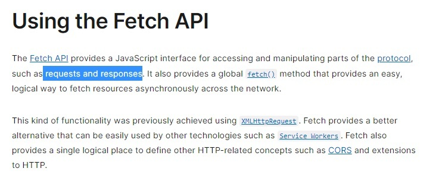
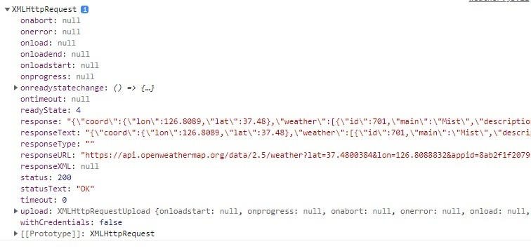

# 22장 this + 26장 ES6 함수의 추가기능

---

# this 의 역할

```
const cricle = {
  radius:5,

  getDiameter() {
    return 2 * circle.radius
  }
}

circle.getDiameter()
```

아직 생성되지 않은 식별자를 위해

```
function Circle(radius) {
  ???.radius = raduis
}

Circle.prototype.getDiameter = function() {
  return 2 * ????.radius
}

const myCircle = new Circle(10)
```

---

## callback에는 무조건 화살표 함수를 써야할까?

### this binding

| 종류        | 일반함수              | 메서드       | 화살표함수             |
| ----------- | --------------------- | ------------ | ---------------------- |
| 형태        | function funcName(){} | function(){} | ()=>{}                 |
| this 바인딩 | 전역객체              | 호출한 객체  | 상위스코프의 this 복제 |

---

# 메서드와 화살표함수의 바인딩 차이

<br>

- 메서드
  - A객체 > B 메서드 > C 메서드
    - C의 this는 B객체를 가리킴

<br>

- 화살표함수
  - A객체 > B 메서드 >C 화살표 함수
    - C의 this는 A객체를 가리킴

---

# callback에 화살표 함수 쓰세요.

```
class Prefixer {
    constructor(prefix) {
        this.prefix = prefix;
        }
    add(arr) {
        return arr.map(function(item) {
        return this.prefix + item;
        }); // this가 arr을 가리킨다.
    }
}

new Prefixer("hello").add([a, b])
```

화살표 함수 사용시

```
//this가 arr의 this와 같은것을 가리킨다.
add(arr) {
    return arr.map(item => this.prefix + item);
}
```

---

# callback에 화살표 함수 쓰지마세요

mongoose.schema.pre("save", callback)

```
// video가 save할때마다 발동.
videoSchema.pre("save", async function () {
      this.hashtags = this.hashtags[0]
      .split(",")
      .map((word) => (word.startsWith("#") ? word : `#${word}`));
    });
```

mongoose.schema.model.create({})

```
// 비디오를 생성후 저장하는 메서드 ->  save동작
Video.create({
      title,
      description,
      hashtags,
    });
```

---

### arrow function을 사용하면 안되는 이유

```
videoSchema.pre("save", async function () {
this.hashtags = this.hashtags[0]
.split(",")
.map((word) => (word.startsWith("#") ? word : `#${word}`));
});

```

- 내부동작 callback은 videoSchema가 아닌, 새로 생성된 객체에 의해 호출된다.
  `createdvideo.callback`

- 메서드

  - 동적으로 this가 createdvideo에 바인딩된다.

- 화살표 함수

  - 정적으로 상위 스코프 this를 이어받는다. (lexical this)
  - createdvideo 것을 받을 수 없다.

---

# 43장 Ajax : XMLHTTPRequest 객체로 fetch를 대체해보자.

---

# Fetch



```
Fetch Api는 프로토콜의 요청 및 응답(requests and responses)과 같은 부분에
대한 접근 및 조작 기능을 제공하는 자바스크립트 인터페이스입니다.

fetch() 메서드를 사용한다면 네트워크를 가로질러
비동기적으로 resources(자원, 정보)를 가져오는 쉽고 논리적인 방법을 제공합니다.

과거 이러한 기능은 XMLHttpRequest를 통해 수행되곤 했습니다.
하지만 Fetch가 더 나은 대안입니다... (중략)
```

---

# Fetch 코드

```
fetch(url)
    .then((response) => response.json())
    .then((data) => {
      city.innerText = data.name;
      weather.innerText = `${data.weather[0].main} / ${data.main.temp}`;
    });
```

---

# XMLHTTPRequset 코드

```
const req = new XMLHttpRequest(); // 1. 생성

req.onreadystatechange = () =>{                    // 2. 이벤트 리스너
  if (req.readyState === XMLHttpRequest.DONE) {
    const data = JSON.parse(req.responseText);

    city.innerText = data.name;
    weather.innerText = `${data.weather[0].main} / ${data.main.temp}`
  }
}

req.open("get", url); // 3. HTTP 통신 설정
req.send(); // 4. 전송요청
```

---

# open 과 send 메서드

- open: HTTP 통신 설정 초기화

```
req.open("get", url);
```

- send: 전송코드, 요청을 XMLHTTPRequest 객체에 반환한다.

```
req.send(); // 4. 전송요청
```

    - 반환 응답은 responseText 속성에 저장.

---

# onreadystatechange ? readyState?

readyState: 통신상태를 나타내는 XMLHTTPRequest의 속성

```
0: "UNSENT" - XHR 오브젝트가 생성되었으나, open 메서드가 실행되기 전이다.
1: "OPENED" - open 메서드가 실행되었다. 하지만 send메서드는 실행되지 않았다.
2: "HEADER_RECEIVED"  - send 메서드가 실행되어 요청이 전송되었다.
3: "LOADING" -  현재 응답이 도착하고 있다.
4: "DONE" - 전체 응답이 도착했고, 사용할 수 있다.
```

onreadystatechange: readystate의 변화를 감지하는 이벤트 리스너

---

```
const req = new XMLHttpRequest(); // 1. 생성

req.onreadystatechange = () =>{                    // 2. 이벤트 리스너
  if (req.readyState === XMLHttpRequest.DONE) {
    const data = JSON.parse(req.responseText);

    city.innerText = data.name;
    weather.innerText = `${data.weather[0].main} / ${data.main.temp}`
  }
}

req.open("get", url); // 3. HTTP 통신 설정
req.send(); // 4. 전송요청
```

---

# XMLHTTPRequest 객체 살펴보기



---

# 왜 XMLHTTPRequest는 Fetch에 의해 대체되는가

### 1. 응답을 받아오는 방식의 차이

-XMLHTTPRequest : 객체내부에 responseText로 받아온다

  <br>
  
  -Fetch: Promise를 반환한다

### 2. Fetch는 no-cors 요청이 가능하다

- cors(cross origin request sharing) 서로다른 api의 자원을 공유하는것.

---

링크

https://developer.mozilla.org/ko/docs/Web/HTTP/CORS
https://web.dev/why-coop-coep/
