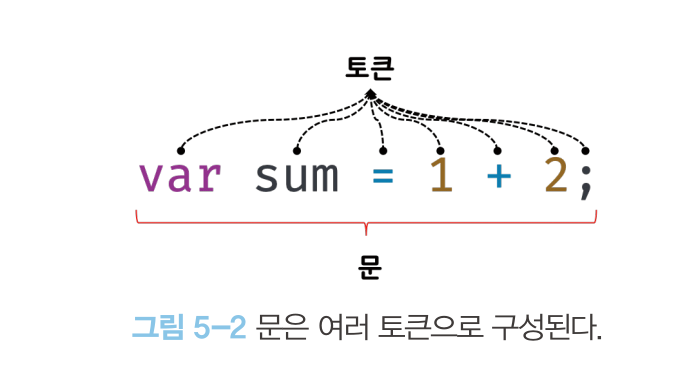
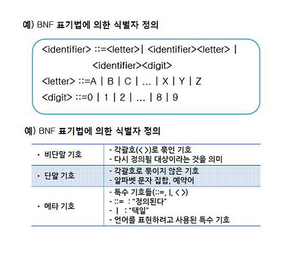
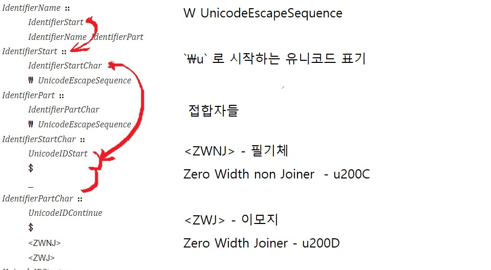
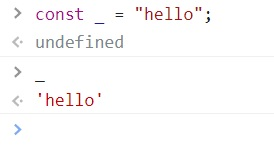
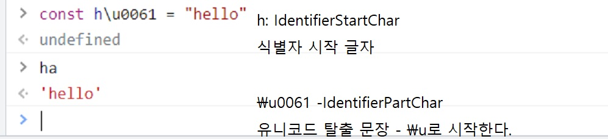

# 모던 자바스크립트 딥다이브 5장: 표현식과 문

- 공부내용
  5.4 문에대한 공부

- 문을 작성하는 규칙
  - 구문
  - 의미

---

# 문 (Statement) 이란?

- 문은 프로그램을 구성하는 기본 단위이자 최소 실행 단위

<br>

- 문은 프로그램 코드의 처리 단위
  <br> <br>

프로그래밍이란 문을 작성하고 순서에 맞게 나열하는것

---

## 문의 구성



- 문은 토큰으로 구성되어있다.

  `토큰`은 문법적으로 더이상 나눌 수 없는 코드의 기본 요소.

- 토큰은 자연어의 형태소와 같다.

  `형태소`는 뜻을 가진 가장 작은 말의 단위

---

## 문을 잘 작성하는법 = 토큰을 의도에 맞게 잘 배치하는법

- 1. 구문적으로 오류가 없어야한다.<br> <br>

  - 비문으로 작성시 코드 해석기 (컴파일러, 인터프리터) 는 알아듣지 못한다.

  - 구문오류 발생-> 프로그램 실행시 오류메시지가 자동적으로 console에 출력된다.
    <br>

- 2. 의미적으로 개발자의 의도대로 실행되어야 한다. <br> <br>

  - 문법적으로 오류가 없어도, 정상적으로 실행된다.

  - 의미오류 발생-> console.log 및 디버거 툴로, 실행흐름을 살펴보아야한다.
    <br>

---

# 함수나 객체 사용 문법은 MDN 문서

<br>

# 모르는 API는 DOC이나 깃허브

### 그런데 문법은 어떻게 묘사하지?

---

## 구문작성 규칙 BNF(Backus-Naur Form) 및 EBNF

<div style="display: flex; align-items: center;">
    <div style="width: 50%; padding-left: 20px;">
    Backus-Naur가 프로그래밍 언어 `algol`을 위한 명세에 사용한 표기법 <br><br>
    메타기호, 비단말기호(non-terminal), <br> 단말기호(terminal)로 구성. <br>
    
    </div>
    
</div>

---

## 자바스크립트 구현 명세: ECMASCRIPT

자바스크립트는 브라우저별로 다른 엔진을 가지고있다. <br>

- 다들 구현방식이 다르다.
- 하지만 코드의 생김새는 같다

### ECMASCRIPT 토큰의 구성

<div style="display: flex; align-items: center;">

</div>

---

## identifierName 식별자 구현 규칙



---

## 예시





---

## Zero width Joiner


---

## 의미 명세 작성하기

- BNF 처럼 의미를 표시하기 위한 문법도 존재 - [x -> y]

<br> <br>

- 하지만 현재 의미는 자연어로 기술

---

# 구문적으로 옳은지, 의미적으로 옳은지 잘 생각합시다.

# 감사합니다.

---

# 모던 자바스크립트 딥다이브 6장: 타입

- 공부내용: falsy

  - 모든 표현식은 조건문 안에서 true나 false로 평가된다.
  - if, while 조건문을 사용할 때 false로 평가되는 값들

---

# 조건문에 들어갈때와 나올때가 다르다.

- 입력: 조건문의 괄호 안에는 여러가지 타입이 입력가능

```
if (바로 여기) {}

while(그래 여기){}
```

<br>

- 출력: 모두 부울리언(boolean)타입- true, 혹은 false로 평가

  - true로 평가되는 값들: truthy

  - false로 평가되는 값들: falsy

## `Boolean() 함수로 반환값을 확인할수 있다.`

---

# falsy 를 알아야 하는 이유

### 배열의 성분 포함 여부를 검사하는 함수

```
const checkIndex = function (성분, 배열) {
    const 성분인덱스 = arrInput.indexOf(성분)
    if (성분인덱스) {
        console.log(`입력한 값 ${성분}의 index는 ${성분인덱스} 입니다.`)
        return 성분인덱스
        }
        else {
        console.log(`입력값 ${성분}은 해당 배열에 존재하지 않습니다.`)
        }
}
```

checkIndex("b", ["b",2,7,"y"])
//입력값 b은 해당 배열에 존재하지 않습니다.

---

### 문서를 잘 읽어야 하는 이유

` 배열에 성분이 존재하지 않으면 indexof는 -1을 반환한다.`
<br>
<br>
checkIndex("c", ["b",2,7,"y"])
//입력한 값 c의 index는 -1 입니다

---

# falsy 값 표

| Value     | TypeValue              |
| --------- | ---------------------- |
| false     | Boolean 부울리안       |
| 0         | Number 숫자            |
| ""        | String 문자열          |
| null      | null object 오브젝트   |
| undefined | undefined 정의되지않음 |
| NaN       | NaN number 숫자        |

---

# 조건문에서 false로 평가되는 값을 외워놓읍시다.

# 감사합니다.
