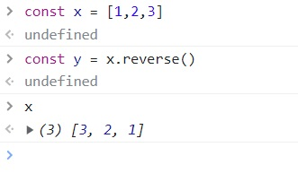
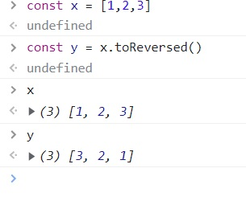
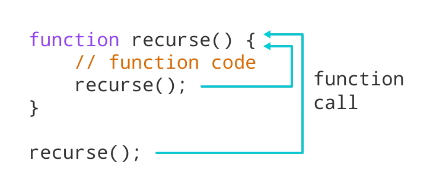

# 함수형 프로그래밍소개

---

# 발표목차

- 선정이유 소개

- 프로그래밍 패러다임

- 함수형 프로그래밍의 4가지 요소
  - 1. 순수함수
  - 2. 불변성
  - 3. 고차함수
  - 4. 재귀

---

# 선정 이유

3주차에서 등장하는 주제들을 아우른다

- 전역변수의 네임스페이스 오염, 성능저하 -> 모듈화

- 객체의 가변성 -> 객체 변경 을 방지하는 방법

---

-프로그래밍 패러다임

- 패러다임?
  - 인식의 체계, 철학
    - 철학? - 생각하는 방식
      

---

# 패러다임의 종류

| 절차형                                      | 객체지향                | 함수형                       |
| ------------------------------------------- | ----------------------- | ---------------------------- |
| 프로그램은 코드를 순차적으로 실행하는 절차. | 프로그램은 객체의 집합. | 프로그램은 순수 함수의 조합. |

---

# 함수형의 핵심요소 4개

순수함수, 불변성, 고차함수, 재귀

---

# 순수함수

<div style="display:flex; align-items:center; justify-content:space-evenly;">
    <ul>
      <li>동일한 입력값 -> 동일 반환값 </li>
      <li>함수의 실행이 전체에 주는 영향이 없다. </li>
      <li>부수효과가 없다.</li>
    </ul>
    
</div>

---

# 순수함수 예시

- 비 순수함수

```
//전역 변수를 번경시킨다.

let count = 0;

const countNum = () => {
    count = count + 1
    return count
    }
```

- 순수함수

```
// 받은 인자에 1을 더한 후 내보낸다.

const countFunc = num => num +1 ;
```

---

# 불변성

기존 데이터를 변화시키지 않는다.

```

        가변성                             불변성
    Original Data                      Original Data
       +-----+                           +-----+
       |     |                           |     |
       +-----+                           +-----+
          |                                 |

         작업                              작업

          |                                 |
    Original Data                      Original Data
       ㅇ----ㅇ                          +-----+
       |     |                           |     |
       ㅇ----ㅇ                          +-----+

```

---

# 불변성 예시

<div style="display:flex; align-items:center; justify-content:space-evenly;">
   <div>
   <p>기존 객체 변화</p>
   
   </div>
   <div>
   <p>기존 객체 유지</p>
   
   </div>
</div>

- 대충 built-in 을 쓴다고 전부 함수형은 아니다.

---

# 고차함수

<div style="display:flex; align-items:center; justify-content:space-evenly;">
    <ul>
      <li>함수가 일급객체</li>
      <li>함수를 인자로써 전달</li>
      <li>함수의 반환 값으로 전달</li>
    </ul>
    
</div>

---

# 재귀

<div style="display:flex; align-items:center; justify-content:space-evenly;">
    <ul>
      <li>반복문을 대체</li>
      <li>상태 추적 요구 없음</li>
      <li>탈출 조건 필요</li>
    </ul>
    
</div>

---

# 재귀 예시

```
const  sumToOne = function (num) {
 let sum = 0;
  for (let i = num; i > 0; i--) {
    sum += i;
  }
  return sum;
}
```

위의 코드를 아래의 코드로 대체합니다.

```
const sumToOne = num => num > 0 ? num + sumToOne(num - 1) : "0";
```

---

# 재귀는 탈출조건이 반드시 필요


---

# 요약

함수형 프로그래밍의 장점

1. 전역변수 배제

   - 함수 그자체로 모듈화: 네임스페이스 및 성능 개선

2. 객체 불변

   - 방어적 복사, 불변객체를 적극 활용. 기존 데이터를 보존할 수있음.

---

# 감사합니다.

질문받을까요?
