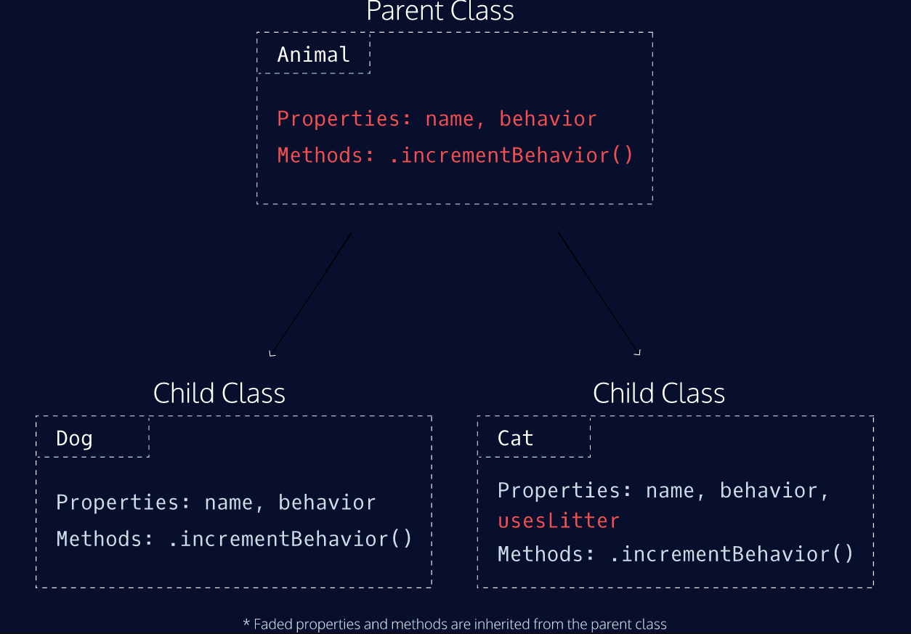

# 25.클래스

### 클래스는 프로토타입의 문법적 설탕인가?

---

클래스와 생성자 함수 모두 프로토타입 기반의 인스턴스 생성. 

- 클래스와 생성자 함수 차이점:
    1. 클래스를 new 연산자 없이 호출하면 에러가 발생한다. 생성자 함수를 new 연산자 없이 호출하면 일반 함수로서 호출된다.
    2. 클래스는 상속을 지원하는 extends와 super키워드를 제공하지만 생성자 함수는 그렇지 않다.
    3. 클래스는 호이스팅이 발생하지 않는 것처럼 동작한다. 생성자 함수는 함수 선언문 정의시 함수 호이스팅이, 함수 표현식으로 정의 시 변수 호이스팅이 발생한다.
    4. 클래스 내의 모든 코드에는 암묵적으로 strict mode가 지정되어 실행되며 해제할 수 없다. 하지만 생성자 함수는 그렇지 않다.

클래스를 프로토타입 기반 객체 생성 패턴의 단순한 문법적 설탕(??)이라고 보기보다는 새로운 **객체 생성 매커니즘**으로 보는 것이 좀 더 합당하다.

### 클래스 정의

---

클래스는 `class`키워드를 사용하여 정의한다. 클래스 이름은 생성자 함수와 마찬가지로 파스칼 케이스를 사용하는 것이 일반적이다.

클래스는 함수다.

⇒ 클래스는 값처럼 사용할 수 있는 일급 객체다.

**클래스 = 붕어빵 기계, 객체 = 붕어빵**

### 클래스 호이스팅

---

클래스는 함수로 평가된다.

클래스 선언문으로 정의한 클래스는 런타임 이전에 먼저 평가되어 함수 객체를 생성한다. 

위 함수 객체는 생성자 함수로서 호출할 수 있는 함수, `constructor` 이다.

프로토타입도 더불어 생성된다. 프로토타입과 생성자 함수는 단독으로 존재할 수 없고 언제나 쌍으로 존재하기 때문.

단, 클래스는 클래스 정의 이전에 참조할 수 없다.

클래스는 let, const키워드로 선언한 변수처럼 호이스팅된다. 클래스 선언문 이전에 일시적 사각지대(TDZ)에 빠지기 때문에 호이스팅이 발생하지 않는 것처럼 동작한다.

### 인스턴스 생성

---

클래스는 new 연산자와 함께 호출되어 인스턴스를 생성한다.

클래스는 인스턴스를 생성하는 것이 유일한 존재 이유로 반드시 new 연산자와 함께 호출해야 한다.

클래스 표현식에서 사용한 클래스 이름은 외부 코드에서 접근 불가능하다.

### 메서드

---

클래스 몸체에서 정의할 수 있는 메서드는 constructor(생성자), 프로토타입 메서드, 정적 메서드 세 가지가 있다.

- **constructor**
    
    인스턴스를 생성하고 초기화하기 위한 특수한 메서드. constructor는 이름 변경 불가.
    
    constructor 내부의 this는 생성자 함수와 마찬가지로 클래스가 생성한 인스턴스를 가리킨다.
    
    메서드로 해석되는 것이 아니라 클래스가 평가되어 생성한 함수 객체 코드의 일부가 된다.
    
    클래스 내에 최대 한 개만 존재할 수 있다.
    
    constructor를 생략하면 빈 constructor가 암묵적으로 정의된다.
    
- **프로토타입 메서드**
    
    클래스는 생성자 함수와 같이 인스턴스를 생성하는 생성자 함수라고 볼 수 있다.
    
    ⇒ 클래스는 생성자 함수와 마찬가지로 프로토타입 기반의 객체 생성 매커니즘이다.
    
- **정적 메서드**
    
    인스턴스를 생성하지 않아도 호출할 수 있는 메서드.
    
    클래스에서는 메서드에 static 키워드를 붙이면 정적 메서드(클래스 메서드)가 된다.
    
    정적 메서드는 인스턴스로 호출할 수 없다. 정적 메서드가 바인딩된 클래스는 인스턴스의 프로토타입 체인상에 존재하지 않기 때문이다. 
    
    정적 메서드는 애플리케이션 전역에서 사용할 유틸리티 함수를 전역 함수로 정의하지 않고 메서드로 구조화할 때 유용하다. ex. `Math.max(1,2,3), Number.isNaN(NaN), JSON.stringify({a :1})` 
    
- **정적 메서드와 프로토타입 메서드의 차이**
    1. 자신이 속해있는 프로토타입 체인이 다르다.
    2. 정적 메서드는 클래스로 호출하고 프로토타입 메서드는 인스턴스로 호출한다.
    3. 정적 메서드는 인스턴스 프로퍼티를 참조할 수 없지만 프로토타입 메서드는 인스턴스 프로퍼티를 참조할 수 있다.

### 클래스의 인스턴스 생성 과정

---

1. 인스턴스 생성과 this 바인딩
    1. new 연산자 클래스 호출
    2. constructor 내부 코드가 실행되기 앞서 암묵적으로 빈 객체 생성
    3. 클래스가 생성한 인스턴스의 프로토타입으로 클래스의 prototype 프로퍼티가 가리키는 객체 설정
    4. 인스턴스는 this에 바인딩 ⇒ constructor 내부의 this는 클래스가 생성한 인스턴스 
2. 인스턴스 초기화
    
    constructor 내부 코드가 실행되어 this에 바인딩되어있는 인스턴스를 초기화한다.
    
3. 인스턴스 반환
    
    클래스의 모든 처리가 끝나면 완성된 인스턴스가 바인딩된 this가 암묵적으로 반환된다.
    

### 상속에 의한 클래스 확장

---

- 클래스 상속과 생성자 함수 상속
    
    상속에 의한 클래스 확장은 기존 클래스를 상속받아 새로운 클래스를 확장하여 정의.
    
    클래스는 상속을 통해 기존 클래스를 확장할 수 있는 문법이 기본적으로 제공되지만 생성자 함수는 그렇지 않다.
    
    클래스는 상속을 통해 다른 클래스를 확장할 수 있는 문법인 `extends` 키워드가 기본적으로 제공된다.
    
- extends 키워드
    
    **상속을 통해 확장된 클래스:** 서브클래스, 파생 클래스, 자식 클래스
    
    **서브클래스에게 상속된 클래스:** 수퍼클래스, 베이스 클래스, 부모 클래스
    
    **부모와 자식관계**
    
    
    
- 동적 상속
    
    extends 키워드는 클래스뿐만 아니라 생성자 함수를 상속받아 클래스를 확장할 수도 있다. 단, extends 키워드 앞에는 반드시 클래스가 와야한다.
    
- 서브 클래스의 constructor
    
    수퍼클래스와 서브클래스 모두 constructor를 생략하면 빈 객체가 생성된다. 프로퍼티를 소유하는 인스턴스를 생성하려면 constructor 내부에서 인스턴스에 프로퍼티를 추가해야 한다.
    
- super 키워드
    
    함수처럼 호출할 수도 있고 this와 같이 식별자처럼 참조할 수 있는 특수한 키워드다. 
    
    - super를 호출하면 수퍼클래스의 constructor를 호출한다.
        - 호출시 주의사항
            - 서브클래스에서 constructor를 생략하지 않는 경우 서브클래스의 constructor에서는 반드시 super를 호출해야한다.
            - 서브클래스의 constructor에서 super를 호출하기 전에는 this를 참조할 수 없다.
            - super는 반드시 서브클래스의 constructor에서만 호출한다. 서브클래스가 아닌 클래스의 constructor나 함수에서 super를 호출하면 에러가 발생한다.
    - super를 참조하면 수퍼클래스의 메서드를 호출할 수 있다.
- 상속 클래스의 인스턴스 생성 과정
    1. 서브클래스의 super 호출
        
        서브클래스는 자신이 직접 인스턴스를 생성하지 않고 수퍼클래스에게 인스턴스 생성을 위임한다. ⇒ 서브클래스의 constructor에서 반드시 super를 호출해야 하는 이유.
        
    2. 수퍼클래스의 인스턴스 생성과 this 바인딩       
    3. 수퍼클래스의 인스턴스 초기화
    4. 서브클래스 constructor로의 복귀와 this바인딩
        
        super가 반환한 인스턴스가 this에 바인딩된다. 서브클래스는 별도의 인스턴스를 생성하지 않고 super가 반환한 인스턴스를 this에 바인딩하여 그대로 사용한다. 
        
    5. 서브클래스의 인스턴스 초기화
    6. 인스턴스 반환